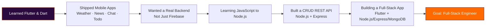

  

  

---

### 👋 About Me

I'm a Junior Software Engineer with over a year of experience building mobile apps with **Flutter & Dart** — from Clean Architecture patterns to state management (Bloc/Cubit, Provider) and REST API integration.

I'm now expanding into backend development, going deep into **JavaScript → Node.js** so I can build true full-stack applications instead of relying only on Firebase. I learn the same way I always have: by shipping a real project, not just watching tutorials.

- 🔭 **Real-world project:** Warehouse Management System for a cold storage business — evolving it from an Excel-based workflow into a full Flutter + Node.js/Express/MongoDB stack
- 📚 **Practice project:** ColdTrack, a cold-chain inventory system I built to lock in JavaScript fundamentals
- ⚙️ **Recently built:** A CRUD REST API with Node.js + Express (GET/POST/PUT/DELETE)
- 🌱 **Currently learning:** Express-style backend fundamentals, MongoDB/Mongoose
- 🌍 **Also interested in:** offline-first mobile apps for Arabic-speaking markets
- 🛠️ **Also comfortable with:** Firebase, SQL, Git & GitHub
- 💬 **Ask me about:** Flutter, Firebase, or backend fundamentals with Node.js/Express
- 📫 **Reach me:** [mohamed.work78@gmail.com](mailto:mohamed.work78@gmail.com)

---

### 🧭 The Journey So Far

---

### 🧰 Tech Stack

**Mobile**

  
  
  
  
  
  

**Backend (Actively Growing)**

  
  
  
  

**Tools**

  
  
  

---

### 🚧 What I'm Building Right Now

| Project | Status | What it is |
|---|---|---|
| **Warehouse Management System** | 🔄 In progress · Portfolio project | Real-world app for a cold storage business — moving it from an Excel-based workflow to a full Flutter + Node.js/Express/MongoDB stack |
| **ColdTrack** | 📚 Practice project | A cold-chain warehouse inventory system built specifically to drill JavaScript fundamentals before diving into Node.js |
| **CRUD REST API** | ✅ Built | A Node.js + Express API with full GET/POST/PUT/DELETE operations |

---

### 📱 Shipped Projects

- 📖 [Islamic App](https://github.com/Mohamed20186/islami_app) — Quran, Hadith, and Islamic radio
- ⛅ [Weather App](https://github.com/Mohamed20186/weather_app) — MVVM architecture
- 📰 [News App](https://github.com/Mohamed20186/newss_app) — Provider state management
- 💬 [Chat App](https://github.com/Mohamed20186/chat_app) — Real-time chat with Firebase Auth
- ✅ [Todo App](https://github.com/Mohamed20186/todo_app) — Firebase Auth + Firestore

---

### 📊 GitHub Stats

  
  

  

  

---

### 📫 Let's Connect

  
  
  
  

📍 Egypt &nbsp;•&nbsp; 

  

